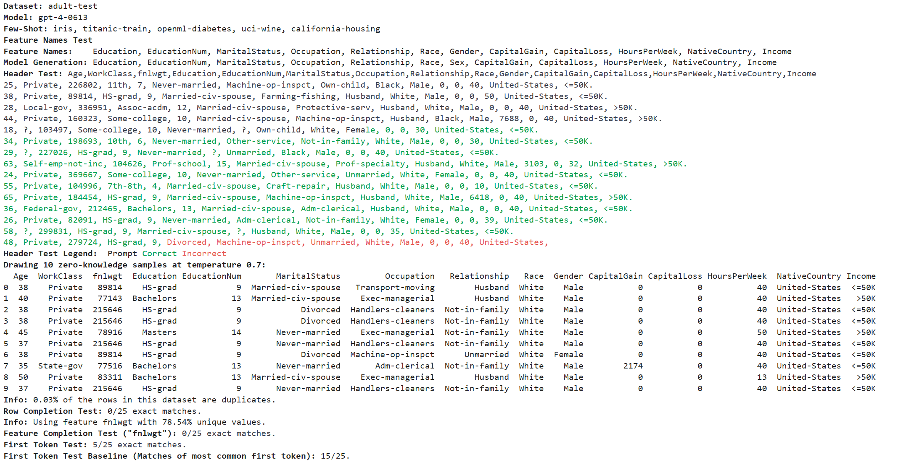

# 🐘 Testing Language Models for Memorization of Tabular Data


[](https://github.com/interpretml/LLM-Tabular-Memorization-Checker/actions/workflows/run_tests.yaml)
[](http://interpret.ml/LLM-Tabular-Memorization-Checker/)


Tabmemcheck is an open-source Python library to test language models for memorization of tabular datasets. 
 
Features:
- [x] Test GPT-3.5, GPT-4, and other LLMs for memorization of tabular datasets.
- [x] Supports chat models and (base) language models. In chat mode, the prompts are designed toward GPT-3.5 and GPT-4. We recommend testing the base models with other LLMs. 
- [x] Based entirely on prompts (no access to the probability distribution over tokens ('logprobs') is required).
- [x] The submodule ``tabmemcheck.datasets`` allows to load tabular datasets in perturbed form (``original``, ``perturbed``, ``task``, ``statistical``).

The different tests are described in a Neurips'23 workshop [paper](https://arxiv.org/abs/2403.06644).

### Installation

```
pip install tabmemcheck
```

Then use ```import tabmemcheck``` to import the Python package.

# Overview

The package provides four different tests for verbatim memorization of a tabular dataset (header test, row completion test, feature completion test, first token test).

The header test asks the LLM to complete the initial rows of a CSV file.

```python
header_prompt, header_completion, response = tabmemcheck.header_test('uci-wine.csv', 'gpt-3.5-turbo-0613', completion_length=350)
```

target,alcohol,malic_acid,[...],proline<br>1,14.23,1.71,2.43,15.6,127,2.8,3.06,.28,2.29,5.64,1.04,3.92,1065<br>1,13.2,1.78,2.14,11.2,100,2.65,2.76,.26,1.28,4.38,1.05,3.4,1050<br>1,13.16,2.36,2.67,18.6,101,2.8,3.24,.<span style="background-color:#7CFC00">3</span><span style="background-color:#EE4B2B">9</span><span style="background-color:#7CFC00">,</span><span style="background-color:#7CFC00">2</span><span style="background-color:#7CFC00">.</span><span style="background-color:#7CFC00">8</span><span style="background-color:#7CFC00">1</span><span style="background-color:#7CFC00">,</span><span style="background-color:#EE4B2B">2</span><span style="background-color:#EE4B2B">.</span><span style="background-color:#EE4B2B">2</span><span style="background-color:#EE4B2B">9</span><span style="background-color:#EE4B2B">,</span><span style="background-color:#7CFC00">5</span><span style="background-color:#7CFC00">.</span><span style="background-color:#7CFC00">6</span><span style="background-color:#7CFC00">8</span><span style="background-color:#7CFC00">,</span><span style="background-color:#7CFC00">1</span><span style="background-color:#7CFC00">.</span><span style="background-color:#7CFC00">0</span><span style="background-color:#7CFC00">3</span><span style="background-color:#7CFC00">,</span><span style="background-color:#7CFC00">3</span><span style="background-color:#7CFC00">.</span><span style="background-color:#7CFC00">1</span><span style="background-color:#7CFC00">7</span><span style="background-color:#7CFC00">,</span><span style="background-color:#7CFC00">1</span><span style="background-color:#7CFC00">1</span><span style="background-color:#7CFC00">8</span><span style="background-color:#7CFC00">5</span><span style="background-color:#7CFC00">
    </span><br><span style="background-color:#7CFC00">1</span><span style="background-color:#7CFC00">,</span><span style="background-color:#7CFC00">1</span><span style="background-color:#7CFC00">4</span><span style="background-color:#7CFC00">.</span><span style="background-color:#7CFC00">3</span><span style="background-color:#7CFC00">7</span><span style="background-color:#7CFC00">,</span><span style="background-color:#7CFC00">1</span><span style="background-color:#7CFC00">.</span><span style="background-color:#7CFC00">9</span><span style="background-color:#7CFC00">5</span><span style="background-color:#7CFC00">,</span><span style="background-color:#7CFC00">2</span><span style="background-color:#7CFC00">.</span><span style="background-color:#7CFC00">5</span><span style="background-color:#7CFC00">,</span><span style="background-color:#7CFC00">1</span><span style="background-color:#7CFC00">6</span><span style="background-color:#7CFC00">.</span><span style="background-color:#7CFC00">8</span><span style="background-color:#7CFC00">,</span><span style="background-color:#7CFC00">1</span><span style="background-color:#7CFC00">1</span><span style="background-color:#7CFC00">3</span><span style="background-color:#7CFC00">,</span><span style="background-color:#7CFC00">3</span><span style="background-color:#7CFC00">.</span><span style="background-color:#7CFC00">8</span><span style="background-color:#7CFC00">5</span><span style="background-color:#7CFC00">,</span><span style="background-color:#7CFC00">3</span><span style="background-color:#7CFC00">.</span><span style="background-color:#7CFC00">4</span><span style="background-color:#7CFC00">9</span><span style="background-color:#7CFC00">,</span><span style="background-color:#7CFC00">.</span><span style="background-color:#7CFC00">2</span><span style="background-color:#7CFC00">4</span><span style="background-color:#7CFC00">,</span><span style="background-color:#7CFC00">2</span><span style="background-color:#7CFC00">.</span><span style="background-color:#7CFC00">1</span><span style="background-color:#7CFC00">8</span><span style="background-color:#7CFC00">,</span><span style="background-color:#7CFC00">7</span><span style="background-color:#7CFC00">.</span><span style="background-color:#7CFC00">8</span><span style="background-color:#7CFC00">,</span><span style="background-color:#EE4B2B">0</span><span style="background-color:#7CFC00">.</span><span style="background-color:#7CFC00">8</span><span style="background-color:#7CFC00">6</span><span style="background-color:#7CFC00">,</span><span style="background-color:#7CFC00">3</span><span style="background-color:#7CFC00">.</span><span style="background-color:#7CFC00">4</span><span style="background-color:#7CFC00">5</span><span style="background-color:#7CFC00">,</span><span style="background-color:#7CFC00">1</span><span style="background-color:#7CFC00">4</span><span style="background-color:#7CFC00">8</span><span style="background-color:#7CFC00">0</span><span style="background-color:#7CFC00">
    </span><br><span style="background-color:#7CFC00">1</span><span style="background-color:#7CFC00">,</span><span style="background-color:#7CFC00">1</span><span style="background-color:#7CFC00">3</span><span style="background-color:#7CFC00">.</span><span style="background-color:#7CFC00">2</span><span style="background-color:#7CFC00">4</span><span style="background-color:#7CFC00">,</span><span style="background-color:#7CFC00">2</span><span style="background-color:#7CFC00">.</span><span style="background-color:#7CFC00">5</span><span style="background-color:#7CFC00">9</span><span style="background-color:#7CFC00">,</span><span style="background-color:#7CFC00">2</span><span style="background-color:#7CFC00">.</span><span style="background-color:#7CFC00">8</span><span style="background-color:#7CFC00">7</span><span style="background-color:#7CFC00">,</span><span style="background-color:#7CFC00">2</span><span style="background-color:#7CFC00">1</span><span style="background-color:#7CFC00">,</span><span style="background-color:#7CFC00">1</span><span style="background-color:#7CFC00">1</span><span style="background-color:#7CFC00">8</span><span style="background-color:#7CFC00">,</span><span style="background-color:#7CFC00">2</span><span style="background-color:#7CFC00">.</span><span style="background-color:#7CFC00">8</span><span style="background-color:#7CFC00">,</span><span style="background-color:#7CFC00">2</span><span style="background-color:#7CFC00">.</span><span style="background-color:#7CFC00">6</span><span style="background-color:#7CFC00">9</span><span style="background-color:#7CFC00">,</span><span style="background-color:#7CFC00">.</span><span style="background-color:#7CFC00">3</span><span style="background-color:#7CFC00">9</span><span style="background-color:#7CFC00">,</span><span style="background-color:#7CFC00">1</span><span style="background-color:#7CFC00">.</span><span style="background-color:#7CFC00">8</span><span style="background-color:#7CFC00">2</span><span style="background-color:#7CFC00">,</span><span style="background-color:#7CFC00">4</span><span style="background-color:#7CFC00">.</span><span style="background-color:#7CFC00">3</span><span style="background-color:#7CFC00">2</span><span style="background-color:#7CFC00">,</span><span style="background-color:#7CFC00">1</span><span style="background-color:#7CFC00">.</span><span style="background-color:#7CFC00">0</span><span style="background-color:#7CFC00">4</span><span style="background-color:#7CFC00">,</span><span style="background-color:#7CFC00">2</span><span style="background-color:#7CFC00">.</span><span style="background-color:#7CFC00">9</span><span style="background-color:#7CFC00">3</span><span style="background-color:#7CFC00">,</span><span style="background-color:#7CFC00">7</span><span style="background-color:#7CFC00">3</span><span style="background-color:#7CFC00">5</span><span style="background-color:#7CFC00">
    </span><br><span style="background-color:#7CFC00">1</span><span style="background-color:#7CFC00">,</span><span style="background-color:#7CFC00">1</span><span style="background-color:#7CFC00">4</span><span style="background-color:#7CFC00">.</span><span style="background-color:#7CFC00">2</span><span style="background-color:#7CFC00">,</span><span style="background-color:#7CFC00">1</span><span style="background-color:#7CFC00">.</span><span style="background-color:#7CFC00">7</span><span style="background-color:#7CFC00">6</span><span style="background-color:#7CFC00">,</span><span style="background-color:#7CFC00">2</span><span style="background-color:#7CFC00">.</span><span style="background-color:#7CFC00">4</span><span style="background-color:#7CFC00">5</span><span style="background-color:#7CFC00">,</span><span style="background-color:#7CFC00">1</span><span style="background-color:#7CFC00">5</span><span style="background-color:#7CFC00">.</span><span style="background-color:#7CFC00">2</span><span style="background-color:#7CFC00">,</span><span style="background-color:#7CFC00">1</span><span style="background-color:#7CFC00">1</span><span style="background-color:#7CFC00">2</span><span style="background-color:#7CFC00">,</span><span style="background-color:#7CFC00">3</span><span style="background-color:#7CFC00">.</span><span style="background-color:#7CFC00">2</span><span style="background-color:#7CFC00">7</span><span style="background-color:#7CFC00">,</span><span style="background-color:#7CFC00">3</span><span style="background-color:#7CFC00">.</span><span style="background-color:#7CFC00">3</span><span style="background-color:#7CFC00">9</span><span style="background-color:#7CFC00">,</span><span style="background-color:#7CFC00">.</span><span style="background-color:#7CFC00">3</span><span style="background-color:#7CFC00">4</span><span style="background-color:#7CFC00">,</span><span style="background-color:#7CFC00">1</span><span style="background-color:#7CFC00">.</span><span style="background-color:#7CFC00">9</span><span style="background-color:#7CFC00">7</span><span style="background-color:#7CFC00">,</span><span style="background-color:#7CFC00">6</span><span style="background-color:#7CFC00">.</span><span style="background-color:#7CFC00">7</span><span style="background-color:#7CFC00">5</span><span style="background-color:#7CFC00">,</span><span style="background-color:#7CFC00">1</span><span style="background-color:#7CFC00">.</span><span style="background-color:#7CFC00">0</span><span style="background-color:#7CFC00">5</span><span style="background-color:#7CFC00">,</span><span style="background-color:#7CFC00">2</span><span style="background-color:#7CFC00">.</span><span style="background-color:#7CFC00">8</span><span style="background-color:#7CFC00">5</span><span style="background-color:#7CFC00">,</span><span style="background-color:#7CFC00">1</span><span style="background-color:#7CFC00">4</span><span style="background-color:#7CFC00">5</span><span style="background-color:#7CFC00">0</span><span style="background-color:#7CFC00">
    </span><br><span style="background-color:#7CFC00">1</span><span style="background-color:#7CFC00">,</span><span style="background-color:#7CFC00">1</span><span style="background-color:#7CFC00">4</span><span style="background-color:#7CFC00">.</span><span style="background-color:#7CFC00">3</span><span style="background-color:#7CFC00">9</span><span style="background-color:#7CFC00">,</span><span style="background-color:#7CFC00">1</span><span style="background-color:#7CFC00">.</span><span style="background-color:#7CFC00">8</span><span style="background-color:#7CFC00">7</span><span style="background-color:#7CFC00">,</span><span style="background-color:#7CFC00">2</span><span style="background-color:#7CFC00">.</span><span style="background-color:#7CFC00">4</span><span style="background-color:#7CFC00">5</span><span style="background-color:#7CFC00">,</span><span style="background-color:#7CFC00">1</span><span style="background-color:#7CFC00">4</span><span style="background-color:#7CFC00">.</span><span style="background-color:#7CFC00">6</span><span style="background-color:#7CFC00">,</span><span style="background-color:#7CFC00">9</span><span style="background-color:#7CFC00">6</span><span style="background-color:#7CFC00">,</span><span style="background-color:#7CFC00">2</span><span style="background-color:#7CFC00">.</span><span style="background-color:#7CFC00">5</span><span style="background-color:#7CFC00">,</span><span style="background-color:#7CFC00">2</span><span style="background-color:#7CFC00">.</span><span style="background-color:#7CFC00">5</span><span style="background-color:#7CFC00">2</span><span style="background-color:#7CFC00">,</span><span style="background-color:#7CFC00">.</span><span style="background-color:#7CFC00">3</span><span style="background-color:#7CFC00">,</span><span style="background-color:#7CFC00">1</span><span style="background-color:#7CFC00">.</span><span style="background-color:#7CFC00">9</span><span style="background-color:#7CFC00">8</span><span style="background-color:#7CFC00">,</span><span style="background-color:#7CFC00">5</span><span style="background-color:#7CFC00">.</span><span style="background-color:#7CFC00">2</span><span style="background-color:#7CFC00">5</span><span style="background-color:#7CFC00">,</span><span style="background-color:#7CFC00">1</span><span style="background-color:#7CFC00">.</span><span style="background-color:#7CFC00">0</span><span style="background-color:#7CFC00">2</span><span style="background-color:#7CFC00">,</span><span style="background-color:#7CFC00">3</span><span style="background-color:#7CFC00">.</span><span style="background-color:#7CFC00">5</span><span style="background-color:#7CFC00">8</span><span style="background-color:#7CFC00">,</span><span style="background-color:#7CFC00">1</span><span style="background-color:#7CFC00">2</span><span style="background-color:#7CFC00">9</span><span style="background-color:#7CFC00">0</span><span style="background-color:#7CFC00">
    </span><br><span style="background-color:#7CFC00">1</span><span style="background-color:#7CFC00">,</span><span style="background-color:#7CFC00">1</span><span style="background-color:#7CFC00">4</span><span style="background-color:#7CFC00">.</span><span style="background-color:#7CFC00">0</span><span style="background-color:#7CFC00">6</span><span style="background-color:#7CFC00">,</span><span style="background-color:#7CFC00">2</span><span style="background-color:#7CFC00">.</span><span style="background-color:#7CFC00">1</span><span style="background-color:#7CFC00">5</span><span style="background-color:#7CFC00">,</span><span style="background-color:#7CFC00">2</span><span style="background-color:#7CFC00">.</span><span style="background-color:#7CFC00">6</span><span style="background-color:#7CFC00">1</span><span style="background-color:#7CFC00">,</span><span style="background-color:#7CFC00">1</span><span style="background-color:#7CFC00">7</span><span style="background-color:#7CFC00">.</span><span style="background-color:#7CFC00">6</span><span style="background-color:#7CFC00">,</span><span style="background-color:#7CFC00">1</span><span style="background-color:#7CFC00">2</span><span style="background-color:#7CFC00">1</span><span style="background-color:#7CFC00">,</span><span style="background-color:#7CFC00">2</span><span style="background-color:#7CFC00">.</span><span style="background-color:#7CFC00">6</span><span style="background-color:#7CFC00">,</span><span style="background-color:#7CFC00">2</span><span style="background-color:#7CFC00">.</span><span style="background-color:#7CFC00">5</span><span style="background-color:#7CFC00">1</span><span style="background-color:#7CFC00">,</span><span style="background-color:#7CFC00">.</span><span style="background-color:#7CFC00">3</span><span style="background-color:#7CFC00">1</span><span style="background-color:#7CFC00">,</span><span style="background-color:#7CFC00">1</span><span style="background-color:#7CFC00">.</span><span style="background-color:#7CFC00">2</span><span style="background-color:#7CFC00">5</span><span style="background-color:#7CFC00">,</span><span style="background-color:#7CFC00">5</span><span style="background-color:#7CFC00">.</span><span style="background-color:#7CFC00">0</span><span style="background-color:#7CFC00">5</span><span style="background-color:#7CFC00">,</span><span style="background-color:#7CFC00">1</span><span style="background-color:#7CFC00">.</span><span style="background-color:#7CFC00">0</span><span style="background-color:#7CFC00">6</span><span style="background-color:#7CFC00">,</span><span style="background-color:#7CFC00">3</span><span style="background-color:#7CFC00">.</span><span style="background-color:#7CFC00">5</span><span style="background-color:#7CFC00">8</span><span style="background-color:#7CFC00">,</span><span style="background-color:#7CFC00">1</span><span style="background-color:#7CFC00">2</span><span style="background-color:#7CFC00">9</span><span style="background-color:#7CFC00">5</span><span style="background-color:#7CFC00">
    </span><br><span style="background-color:#7CFC00">1</span><span style="background-color:#7CFC00">,</span><span style="background-color:#7CFC00">1</span><span style="background-color:#7CFC00">4</span><span style="background-color:#7CFC00">.</span><span style="background-color:#7CFC00">8</span><span style="background-color:#7CFC00">3</span><span style="background-color:#7CFC00">,</span><span style="background-color:#7CFC00">1</span><span style="background-color:#7CFC00">.</span><span style="background-color:#7CFC00">6</span><span style="background-color:#7CFC00">4</span><span style="background-color:#7CFC00">,</span><span style="background-color:#7CFC00">2</span><span style="background-color:#7CFC00">.</span><span style="background-color:#7CFC00">1</span><span style="background-color:#7CFC00">7</span><span style="background-color:#7CFC00">,</span><span style="background-color:#7CFC00">1</span><span style="background-color:#7CFC00">4</span><span style="background-color:#7CFC00">,</span><span style="background-color:#7CFC00">9</span><span style="background-color:#7CFC00">7</span><span style="background-color:#7CFC00">,</span><span style="background-color:#7CFC00">2</span><span style="background-color:#7CFC00">.</span><span style="background-color:#7CFC00">8</span><span style="background-color:#7CFC00">,</span><span style="background-color:#7CFC00">2</span><span style="background-color:#7CFC00">.</span><span style="background-color:#7CFC00">9</span><span style="background-color:#7CFC00">8</span><span style="background-color:#7CFC00">,</span><span style="background-color:#7CFC00">.</span><span style="background-color:#7CFC00">2</span><span style="background-color:#7CFC00">9</span><span style="background-color:#7CFC00">,</span><span style="background-color:#7CFC00">1</span><span style="background-color:#7CFC00">.</span><span style="background-color:#7CFC00">9</span><span style="background-color:#7CFC00">8</span><span style="background-color:#7CFC00">,</span><span style="background-color:#7CFC00">5</span><span style="background-color:#7CFC00">.</span><span style="background-color:#7CFC00">2</span><span style="background-color:#7CFC00">,</span><span style="background-color:#7CFC00">1</span><span style="background-color:#7CFC00">.</span><span style="background-color:#7CFC00">0</span><span style="background-color:#7CFC00">8</span><span style="background-color:#7CFC00">,</span><span style="background-color:#7CFC00">2</span><span style="background-color:#7CFC00">.</span><span style="background-color:#7CFC00">8</span><span style="background-color:#7CFC00">5</span><span style="background-color:#7CFC00">,</span><span style="background-color:#7CFC00">1</span><span style="background-color:#7CFC00">0</span><span style="background-color:#7CFC00">4</span><span style="background-color:#7CFC00">5</span><span style="background-color:#7CFC00">
    </span><br><span style="background-color:#7CFC00">1</span><span style="background-color:#7CFC00">,</span><span style="background-color:#7CFC00">1</span><span style="background-color:#7CFC00">3</span><span style="background-color:#7CFC00">.</span><span style="background-color:#7CFC00">8</span><span style="background-color:#7CFC00">6</span><span style="background-color:#7CFC00">,</span><span style="background-color:#7CFC00">1</span><span style="background-color:#7CFC00">.</span><span style="background-color:#7CFC00">3</span><span style="background-color:#7CFC00">5</span><span style="background-color:#7CFC00">,</span><span style="background-color:#7CFC00">2</span><span style="background-color:#7CFC00">.</span><span style="background-color:#7CFC00">2</span><span style="background-color:#7CFC00">7</span><span style="background-color:#7CFC00">,</span><span style="background-color:#7CFC00">1</span><span style="background-color:#7CFC00">6</span><span style="background-color:#7CFC00">,</span><span style="background-color:#7CFC00">9</span><span style="background-color:#7CFC00">8</span><span style="background-color:#7CFC00">,</span><span style="background-color:#7CFC00">2</span><span style="background-color:#7CFC00">.</span><span style="background-color:#7CFC00">9</span><span style="background-color:#7CFC00">8</span><span style="background-color:#7CFC00">,</span><span style="background-color:#7CFC00">3</span><span style="background-color:#7CFC00">.</span><span style="background-color:#7CFC00">1</span><span style="background-color:#7CFC00">5</span><span style="background-color:#7CFC00">,</span><span style="background-color:#7CFC00">.</span><span style="background-color:#7CFC00">2</span><span style="background-color:#7CFC00">2</span><span style="background-color:#7CFC00">,</span><span style="background-color:#7CFC00">1</span><span style="background-color:#7CFC00">.</span><span style="background-color:#7CFC00">8</span><span style="background-color:#7CFC00">5</span><span style="background-color:#7CFC00">,</span><span style="background-color:#7CFC00">7</span><span style="background-color:#7CFC00">.</span><span style="background-color:#7CFC00">2</span><span style="background-color:#7CFC00">2</span><span style="background-color:#7CFC00">,</span><span style="background-color:#7CFC00">1</span><span style="background-color:#7CFC00">.</span><span style="background-color:#7CFC00">0</span><span style="background-color:#7CFC00">1</span><span style="background-color:#7CFC00">,</span><span style="background-color:#7CFC00">3</span><span style="background-color:#7CFC00">.</span><span style="background-color:#7CFC00">5</span><span style="background-color:#7CFC00">5</span><span style="background-color:#7CFC00">,</span><span style="background-color:#7CFC00">1</span><span style="background-color:#7CFC00">0</span><span style="background-color:#7CFC00">4</span><span style="background-color:#7CFC00">5</span><span style="background-color:#7CFC00">
    </span><br><span style="background-color:#7CFC00">1</span><span style="background-color:#7CFC00">,</span><span style="background-color:#7CFC00">1</span><span style="background-color:#7CFC00">4</span><span style="background-color:#7CFC00">.</span><span style="background-color:#7CFC00">1</span><span style="background-color:#7CFC00">,</span><span style="background-color:#7CFC00">2</span><span style="background-color:#7CFC00">.</span><span style="background-color:#7CFC00">1</span><span style="background-color:#7CFC00">6</span><span style="background-color:#7CFC00">,</span><span style="background-color:#7CFC00">2</span><span style="background-color:#7CFC00">.</span><span style="background-color:#7CFC00">3</span><span style="background-color:#7CFC00">,</span><span style="background-color:#7CFC00">1</span><span style="background-color:#7CFC00">8</span><span style="background-color:#7CFC00">,</span><span style="background-color:#7CFC00">1</span><span style="background-color:#7CFC00">0</span><span style="background-color:#7CFC00">5</span><span style="background-color:#7CFC00">,</span><span style="background-color:#7CFC00">2</span><span style="background-color:#7CFC00">.</span><span style="background-color:#7CFC00">9</span><span style="background-color:#7CFC00">5</span><span style="background-color:#7CFC00">,</span><span style="background-color:#7CFC00">3</span><span style="background-color:#7CFC00">.</span><span style="background-color:#7CFC00">3</span><span style="background-color:#7CFC00">2</span><span style="background-color:#7CFC00">,</span><span style="background-color:#7CFC00">.</span><span style="background-color:#7CFC00">2</span><span style="background-color:#7CFC00">2</span><span style="background-color:#7CFC00">,</span><span style="background-color:#7CFC00">2</span><span style="background-color:#7CFC00">.</span><span style="background-color:#7CFC00">3</span><span style="background-color:#7CFC00">8</span><span style="background-color:#7CFC00">,</span><span style="background-color:#7CFC00">5</span><span style="background-color:#7CFC00">.</span><span style="background-color:#7CFC00">7</span><span style="background-color:#7CFC00">5</span><span style="background-color:#7CFC00">,</span><span style="background-color:#7CFC00">1</span><span style="background-color:#7CFC00">.</span><span style="background-color:#7CFC00">2</span><span style="background-color:#7CFC00">5</span><span style="background-color:#7CFC00">,</span><span style="background-color:#7CFC00">3</span><span style="background-color:#7CFC00">.</span><span style="background-color:#7CFC00">1</span><span style="background-color:#7CFC00">7</span><span style="background-color:#7CFC00">,</span><span style="background-color:#7CFC00">1</span><span style="background-color:#7CFC00">5</span><span style="background-color:#7CFC00">1</span><span style="background-color:#7CFC00">0</span><span style="background-color:#7CFC00">
    </span><br><span style="background-color:#7CFC00">1</span><span style="background-color:#7CFC00">,</span><span style="background-color:#7CFC00">1</span><span style="background-color:#7CFC00">4</span><span style="background-color:#7CFC00">.</span><span style="background-color:#7CFC00">1</span><span style="background-color:#7CFC00">2</span><span style="background-color:#7CFC00">,</span><span style="background-color:#7CFC00">1</span><span style="background-color:#7CFC00">.</span><span style="background-color:#7CFC00">4</span><span style="background-color:#7CFC00">8</span><span style="background-color:#7CFC00">,</span><span style="background-color:#7CFC00">2</span><span style="background-color:#7CFC00">.</span><span style="background-color:#7CFC00">3</span><span style="background-color:#7CFC00">2</span><span style="background-color:#7CFC00">,</span><span style="background-color:#7CFC00">1</span><span style="background-color:#7CFC00">6</span><span style="background-color:#7CFC00">.</span><span style="background-color:#7CFC00">8</span><span style="background-color:#7CFC00">,</span><span style="background-color:#7CFC00">9</span><span style="background-color:#7CFC00">5</span><span style="background-color:#7CFC00">,</span><span style="background-color:#7CFC00">2</span><span style="background-color:#7CFC00">.</span><span style="background-color:#7CFC00">2</span><span style="background-color:#7CFC00">,</span><span style="background-color:#7CFC00">2</span><span style="background-color:#7CFC00">.</span><span style="background-color:#7CFC00">4</span><span style="background-color:#7CFC00">3</span><span style="background-color:#7CFC00">,</span><span style="background-color:#7CFC00">.</span><span style="background-color:#7CFC00">2</span><span style="background-color:#7CFC00">6</span><span style="background-color:#7CFC00">,</span><span style="background-color:#7CFC00">1</span><span style="background-color:#7CFC00">.</span><span style="background-color:#7CFC00">5</span><span style="background-color:#7CFC00">7</span><span style="background-color:#7CFC00">,</span><span style="background-color:#7CFC00">5</span><span style="background-color:#7CFC00">,</span><span style="background-color:#7CFC00">1</span><span style="background-color:#7CFC00">.</span><span style="background-color:#7CFC00">1</span><span style="background-color:#7CFC00">7</span><span style="background-color:#7CFC00">,</span><span style="background-color:#7CFC00">2</span><span style="background-color:#7CFC00">.</span><span style="background-color:#7CFC00">8</span><span style="background-color:#7CFC00">2</span><span style="background-color:#7CFC00">,</span><span style="background-color:#7CFC00">1</span><span style="background-color:#7CFC00">2</span><span style="background-color:#7CFC00">8</span><span style="background-color:#7CFC00">0</span><span style="background-color:#BF40BF">
    </span><span style="background-color:#BF40BF">1</span><span style="background-color:#BF40BF">,</span><span style="background-color:#BF40BF">1</span><span style="background-color:#BF40BF">3</span><span style="background-color:#BF40BF">.</span><span style="background-color:#BF40BF">7</span>
    </br></br>
    <b>Legend:</b> Prompt, <span style="background-color:#7CFC00">Correct</span>, <span style="background-color:#EE4B2B">Incorrect</span>, <span style="background-color:#BF40BF">Missing</span>
    </br></br>


This package provides several different tests that all require a language model and a tabular dataset. If you have an LLM and a tabular dataset, then you can get started. 

At a high level, all tests rely on the same idea: What aspects of the  dataset can be reproduced by the LLM?

To give a simple example, when we prompt Llama-2-70b with the first couple of rows of the popular Iris dataset

**Prompt:** ```sepal_length,sepal_width,petal_length,petal_width,species
5.1,3.5,1.4,0.2,Iris-setosa
4.9,3,1.4,0.2,Iris-setosa
4.7,3.2,1.3,0.2,Iris-setosa
4.6,3.1,1.5,0.2,Iris-setosa
5,3.```

the model generates the text 

**Generation:** ```6,1.4,0.2,Iris-setosa
5.4,3.9,1.7,0.4,Iris-setosa
4.6,3.4,1.4,0.3,Iris-setosa
5,3.4,1.5,0.2,Iris-setosa
4.4,2.9,1.4,0.2,Iris-setosa
4.9,3.1,1.5,0.1,Iris-setosa
5.4,3.7,1.5,0.2,Iris-setosa
4.8,3.4,1.6,0.2,Iris-setosa
4.8,3,1.4,0.1,Iris-setosa
4.3,3,1.1,0.1,Iris-setosa[...]```

which is the verbatim continuation of the dataset, without a single mistake. 

We call this test - prompting the model with the first couple of rows of the dataset - the ```Header Test```. In the package, it is available as follows

```python
import tabmemcheck

tabmemcheck.header_test("iris.csv", llama2_70b, completion_length=30)
```

One of the key features of this package is that we have implemented prompts that allow us to run the various completion tests not only with (base) language models but also with chat models. Specifically, we have prompts that work with the GPT-3.5 and GPT-4.

```python
# the package uses the Nov'23 version of the OpenAI API
tabmemcheck.header_test("adult-test.csv", "gpt-4-0613")
```

As we document in our [paper](https://openreview.net/pdf?id=l1u7jA60wT), GPT-3.5 and GPT-4 have been pre-trained on many of the popular tabular datasets. 

There is a simple way to run the different tests on a dataset. This generates a small report with the results of the different tests.

```python
tabmemcheck.run_all_tests("adult-test.csv", "gpt-4-0613")
```



# Tests and Features

Here we describe the different tests that can be performed with the tool. Memorization tests are marked with an 🐘. 

### Feature Names 

The feature names test asks the model to complete the feature names of the dataset.

```python
tabmemcheck.feature_names_test('california-housing.csv', 'gpt-3.5-turbo-16k', num_prefix_features=1)
```

The feature names are assumed to be in the first row of the csv file. The test provides the model with the name of the csv file (assumed to be the name of the dataset), and the first ```num_prefix_features``` feature names of the dataset. Note that there are many ways in which the LLM might know the features names without having seen the dataset during training. 

### Feature Values

(comming soon)

### Header Test🐘

The header test splits the dataset at random positions in rows 2, 4, 6, and 8 and ask the model to complete the next rows of the 
dataset from the given position. 

```python
tabmemcheck.header_test('california-housing.csv', 'gpt-3.5-turbo-16k')
```

We condition the model on this task with few-shot examples from other datasets and report the best completion. 

### Row Completion🐘

The row completion test samples random blocks of rows from the dataset and asks the model to complete the next row. 

```python
tabmemcheck.row_completion_test('california-housing.csv', 'gpt-3.5-turbo-16k')
```

This test is similar to the header test except that we ask the model to complete singe rows at random positions in the csv file. The test reports the number of correctly completed rows.

### Feature Completion🐘

The feature completion test asks the model to complete the value of a single feature in a random row of the dataset, given the values of all the other features in that row.

```python
tabmemcheck.feature_completion_test('titanic-test.csv', 'gpt-3.5-turbo-16k', feature_name="Name")
```

The idea behind this test is that the values of the feature which the model attempts to complete should be unique. Examples are the Name feature in the Kaggle Titanic dataset, and the fnlwgt feature in the UCI Adult dataset.

### First Token🐘

The first token test is similar to the row completion test except that we don't ask the model to complete entire rows, but only the first couple of digits of the next row in the dataset.

```python
tabmemcheck.first_token_test('california-housing.csv', 'gpt-3.5-turbo-16k')
```

If the rows of the dataset are known to be random (this is the case on some but not on all datasets), then a completion accuracy better than the modal token is evidence of memorization. The test reports the completion accuracy of the LLM, and the completion accuracy of the modal token. 

### Ordered Completion

(comming soon)

### Prediction

(comming soon)

### Sampling

This feature of the tool asks the model to provide zero-knowledge samples from the dataset. 

```python
tabmemcheck.sample('california-housing.csv', 'gpt-3.5-turbo-16k', num_queries=10)
```

The function returns the valid samples in a pandas dataframe. For a detailed description zero-knowledge samples and the sampling procedure, see our [paper](https://openreview.net/pdf?id=l1u7jA60wT). At a high level, the idea is to condition the model to provide samples from the dataset purely from its parametric knowledge.

### Row Independence

Heuristically test whether the rows in a tabular dataset are independent. 

```python
tabmemcheck.row_independence_test('california-housing.csv', confidence_level=0.99)
```

The test attempts to reject the null hypothesis of row independence at the given confidence level. To do so, the test attempts to predict the value of a feature from the values of the features in the previous rows. Under the assumption of row independence, the MSE of this prediction cannot be better than the MSE of the mean value of the feature.

## CLI Tool

The Python package comes with a CLI tool that works with the OpenAI API.

```
usage: tabmemcheck [-h] [--header-length HEADER_LENGTH] [--num-queries NUM_QUERIES] [--num-prefix-rows NUM_PREFIX_ROWS] [--num-prefix-features NUM_PREFIX_FEATURES] [--target TARGET] [--few-shot [FEW_SHOT ...]] [--cond [COND ...]] [--model MODEL] [--temperature TEMPERATURE] [--out OUT] [--sleep SLEEP] [--pp] [--pr] csv task

Testing Language Models for Memorization of Tabular Data.

positional arguments:
  csv                   A csv file.
  task                  The task that should be performed with the csv file.
                          - all: Automatically perform a series of tests and print a small report.
                          - feature-names: Does the LLM know the feature names from the top row of the csv file?
                          - header: Header test for memorization.
                          - row-completion: Row completion test for memorization.
                          - feature-completion: Feature completion test for memorization.
                          - first-token: First token test for memorization.
                          - row-independence: Row independence test, using a gradient boosted tree and logistic regression.
                          - sample: Zero-knowledge samples from the parametric knowledge of the LLM.

optional arguments:
  -h, --help            show this help message and exit
  --header-length HEADER_LENGTH
  --num-queries NUM_QUERIES
  --num-prefix-rows NUM_PREFIX_ROWS
  --num-prefix-features NUM_PREFIX_FEATURES
  --target TARGET
  --few-shot [FEW_SHOT ...], --names-list [FEW_SHOT ...]
  --cond [COND ...]
  --model MODEL         Default: gpt-3.5-turbo-1106
  --temperature TEMPERATURE
                        Default: 0.0
  --out OUT             Where to save the results (a filename).
  --sleep SLEEP         Number of seconds to sleep after each query to the LLM.
  --pp                  Print prompts and responses.
  --pr                  Print responses only.
```

## Using your own LLM

To use custom LLMs, implement ```tabmemcheck.LLM_Interface```. For example, to use Llama2-70b via [together.ai](https://www.together.ai/)

```python
class TogetherInferenceLLM(tabmemcheck.LLM_Interface):
    def __init__(self, model, api_key):
        self.model = model
        self.api_key = api_key
        self.chat_mode = False

    def completion(self, prompt, temperature, max_tokens):
        payload = {
            "model": self.model,
            "prompt": prompt,
            "max_tokens": max_tokens,
            "temperature": temperature,
            "top_p": 0.7,
            "top_k": 1 if temperature == 0 else 50,
            "repetition_penalty": 1,
            "stream_tokens": False,
        }
        headers = {
            "accept": "application/json",
            "content-type": "application/json",
            "Authorization": f"Bearer {self.api_key}",
        }
        response = requests.post(
            "https://api.together.xyz/inference", json=payload, headers=headers
        )
        return response.json()["output"]["choices"][0]["text"]

llama2_70b = TogetherInferenceLLM( "togethercomputer/llama-2-70b", "xxx")

tabmemcheck.row_completion_test('csv/IRIS.csv', llama2_70b)
```

# Limitations

The tests provided in this package do not guarantee that the LLM has **not** seen or memorized the data. Specifically, it might not be possible to extract the data from the LLM via prompting, even though the LLM has memorized it.

<!--- # FAQ

- Q: What is the relationship between this tool and other techniques such as membership inference queries?

A: Our main objective is to provide tests that can be performed with the kind of query access provided to LLMs like GPT-4. This means that we assume no access to the probability distribution over tokens ('logprobs') and might only be able to run a limited number of queries. In general, test that rely on the logprobs, or even the ability to re-train the model, could be more powerful than our tests. 

- Q: What are the prompts that you use for the different tests?

A: The prompts are given in the Supplement of our [paper](https://openreview.net/pdf?id=l1u7jA60wT). You can also set

```python
tabmemcheck.config.print_prompts = True
tabmemcheck.config.print_responses = True
```

or use the option ```--debug``` with the CLI tool to see the specific prompts and responses for your queries. 

- How can I replicate the results in the paper?

  A: the code will come soon.

--->

# Citation

If you find this code useful in your research, please consider to cite our paper.

```
@inproceedings{bordt2023elephants,
  title={Elephants Never Forget: Testing Language Models for Memorization of Tabular Data},
  author={Bordt, Sebastian and Nori, Harsha and Caruana, Rich},
  booktitle={NeurIPS 2023 Second Table Representation Learning Workshop},
  year={2023}
}
```

# References

Here are some references that we found useful when developing this tool.

Chang et al., ["Speak, Memory: An Archaeology of Books Known to ChatGPT/GPT-4"](https://arxiv.org/abs/2305.00118), EMNLP 2023

Carlini et al., ["Extracting Training Data from Large Language Models"](https://arxiv.org/abs/2012.07805), USENIX Security Symposium 2021

Carlini et al., ["The Secret Sharer: Evaluating and Testing Unintended Memorization in Neural Networks"](https://arxiv.org/abs/1802.08232), USENIX Security Symposium 2019 
