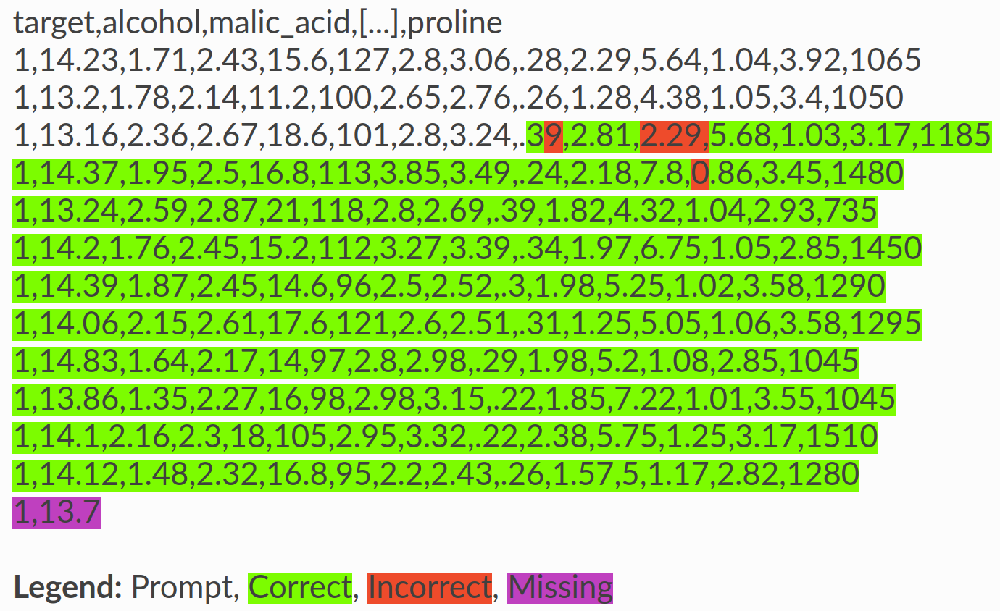
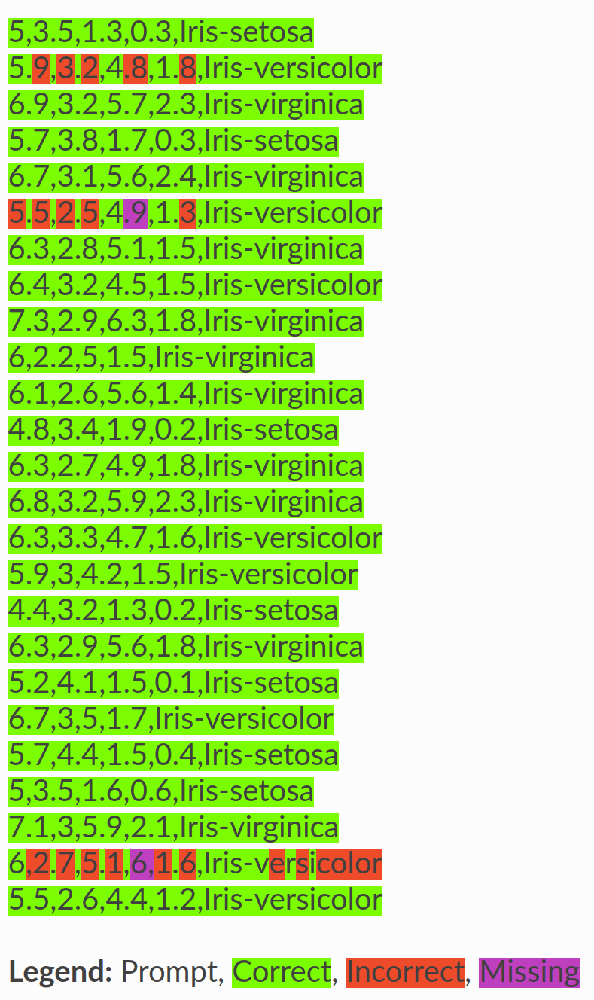

# 🐘 Testing Language Models for Memorization of Tabular Datasets


[](https://github.com/interpretml/LLM-Tabular-Memorization-Checker/actions/workflows/run_tests.yaml)
[](http://interpret.ml/LLM-Tabular-Memorization-Checker/)

<p align="center">
  
</p>

Tabmemcheck is an open-source Python library to test language models for memorization of tabular datasets. 
 
Features:
- [x] Test GPT-3.5, GPT-4, and other LLMs for memorization of tabular datasets.
- [x] Supports chat models and (base) language models. In chat mode, the prompts are designed toward GPT-3.5 and GPT-4. We recommend testing the base models with other LLMs. 
- [x] Based entirely on prompts (no access to the probability distribution over tokens ('logprobs') is required).
- [x] The submodule ``tabmemcheck.datasets`` allows to load tabular datasets in perturbed form (``original``, ``perturbed``, ``task``, ``statistical``).

The different tests are described in a Neurips'23 workshop [paper](https://arxiv.org/abs/2403.06644).

The dataset transforms and the consequences of memorization for few-shot learning are discussed in this [pre-print](https://arxiv.org/abs/2404.06209).

### Installation

```
pip install tabmemcheck
```

Then use ```import tabmemcheck``` to import the Python package.

# Overview

The package provides four different tests for verbatim memorization of a tabular dataset (header test, row completion test, feature completion test, first token test). 

It also provides additional heuristics to assess what an LLM know about a tabular dataset (does the LLM know the names of the features in the dataset?).

The header test asks the LLM to complete the initial rows of a CSV file.

```python
header_prompt, header_completion, response = tabmemcheck.header_test('uci-wine.csv', 'gpt-3.5-turbo-0613', completion_length=350)
```

<p align="left">
  
</p>

Here, we see that ```gpt-3.5-turbo-0613``` can complete the initial rows of the UCI Wine dataset. The function output visualizes the Levenshtein string distance between the actual dataset and the model completion.

The row completion test asks the LLM to complete random rows of a CSV file.

```python
rows, responses = tabmemcheck.row_completion_test('iris.csv', 'gpt-4-0125-preview', num_queries=25)
```

<p align="left">
  
</p>

Here, we see that ```gpt-4-0125-preview``` can complete random rows of the Iris dataset. The function output again visualizes the Levenshtein string distance between the actual dataset rows and the model completions.

The feature completion test asks the LLM to complete the values of a specific feature in the dataset.

```python
feature_values, responses = tabmemcheck.feature_completion_test('/home/sebastian/Downloads/titanic-train.csv', 'gpt-3.5-turbo-0125', feature_name='Name', num_queries=25)
```

<p align="left">
  
</p>

Here, we see that ```gpt-3.5-turbo-0125``` can complete the names of the passengers in the Kaggle Titanic dataset. The function output again visualizes the Levenshtein string distance between the feature values in the dataset and the model completions.

The first token test asks the LLM to complete the first token in the next row of a CSV file.

```python
tabmemcheck.first_token_test('adult-train.csv', 'gpt-3.5-turbo-0125', num_queries=100)
```

```
First Token Test: 37/100 exact matches.
First Token Test Baseline (Matches of most common first token): 50/100.
```
Here, the test provides no evidence of memorization of the Adult Income dataset in ```gpt-3.5-turbo-0125```.

One of the key features of this package is that we have implemented prompts that allow us to run the various completion tests not only with (base) language models but also with chat models (specifically, GPT-3.5 and GPT-4).

There is also a simple way to run all the different tests and generate a small report.

```python
tabmemcheck.run_all_tests("adult-test.csv", "gpt-4-0613")
```
# Documentation

The API documentation of the package is available [here](http://interpret.ml/LLM-Tabular-Memorization-Checker/).

# Testing your own LLM

To test your own LLM, simply implement ```tabmemcheck.LLM_Interface```.

```python
@dataclass
class LLM_Interface:
    """Generic interface to a language model."""

    # if true, the tests use the chat_completion function, otherwise the completion function
    chat_mode = False

    def completion(self, prompt: str, temperature: float, max_tokens: int):
        """Send a query to a language model.

        :param prompt: The prompt (string) to send to the model.
        :param temperature: The sampling temperature.
        :param max_tokens: The maximum number of tokens to generate.

        Returns:
            str: The model response.
        """
        raise NotImplementedError

    def chat_completion(self, messages, temperature: float, max_tokens: int):
        """Send a query to a chat model.

        :param messages: The messages to send to the model. We use the OpenAI format.
        :param temperature: The sampling temperature.
        :param max_tokens: The maximum number of tokens to generate.

        Returns:
            str: The model response.
        """
        raise NotImplementedError
```

# Limitations

The tests provided in this package do not guarantee that the LLM has **not** seen or memorized the data. Specifically, it might not be possible to extract the data from the LLM via prompting, even though the LLM has memorized it.

<!--- # FAQ

- Q: What is the relationship between this tool and other techniques such as membership inference queries?

A: Our main objective is to provide tests that can be performed with the kind of query access provided to LLMs like GPT-4. This means that we assume no access to the probability distribution over tokens ('logprobs') and might only be able to run a limited number of queries. In general, test that rely on the logprobs, or even the ability to re-train the model, could be more powerful than our tests. 

- Q: What are the prompts that you use for the different tests?

A: The prompts are given in the Supplement of our [paper](https://openreview.net/pdf?id=l1u7jA60wT). You can also set

```python
tabmemcheck.config.print_prompts = True
tabmemcheck.config.print_responses = True
```

or use the option ```--debug``` with the CLI tool to see the specific prompts and responses for your queries. 

- How can I replicate the results in the paper?

  A: the code will come soon.

--->

# Citation

If you find this code useful in your research, please consider citing our research papers.

```
@article{bordt2024memorization_learning,
  title={Elephants Never Forget: Memorization and Learning of Tabular Data in
  Large Language Models},
  author={Bordt, Sebastian and Nori, Harsha and Rodrigues, Vanessa and Nushi, Besmira and Caruana, Rich},
  journal={arXiv preprint},
  year={2024}
}

@inproceedings{bordt2023testing,
  title={Elephants Never Forget: Testing Language Models for Memorization of Tabular Data},
  author={Bordt, Sebastian and Nori, Harsha and Caruana, Rich},
  booktitle={NeurIPS 2023 Second Table Representation Learning Workshop},
  year={2023}
}
```

# References

Chang et al., ["Speak, Memory: An Archaeology of Books Known to ChatGPT/GPT-4"](https://arxiv.org/abs/2305.00118), EMNLP 2023

Carlini et al., ["Extracting Training Data from Large Language Models"](https://arxiv.org/abs/2012.07805), USENIX Security Symposium 2021

Carlini et al., ["The Secret Sharer: Evaluating and Testing Unintended Memorization in Neural Networks"](https://arxiv.org/abs/1802.08232), USENIX Security Symposium 2019 
