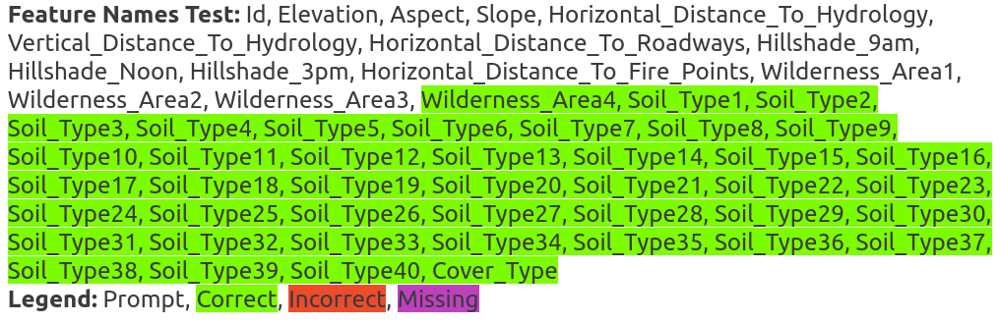
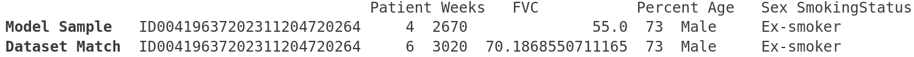
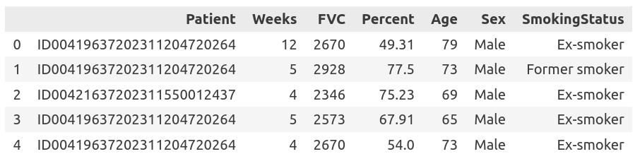
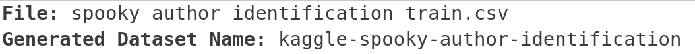

# 🐘 Testing Language Models for Memorization of Tabular Datasets


[](https://github.com/interpretml/LLM-Tabular-Memorization-Checker/actions/workflows/run_tests.yaml)
[](http://interpret.ml/LLM-Tabular-Memorization-Checker/)

<p align="center">
  
</p>

Tabmemcheck is an open-source Python library to test language models for memorization of tabular datasets. 

The package provides four different tests for verbatim memorization of a tabular dataset (header test, row completion test, feature completion test, first token test).

It also provides additional heuristics to test what an LLM knows about a tabular dataset (feature names test, feature values test, dataset name test, and sampling).
 
Features:
- [x] Test GPT-3.5, GPT-4, and other LLMs for prior exposure with tabular datasets.
- [x] Supports chat models and (base) language models. In chat mode, we use few-shot learning to condition the model on the desired behavior.
- [x] The submodule ``tabmemcheck.datasets`` allows to load popular tabular datasets in perturbed form (``original``, ``perturbed``, ``task``, and ``statistical``), as used in our COLM'24 [paper](https://arxiv.org/abs/2404.06209).
- [x] The [code](https://github.com/interpretml/LLM-Tabular-Memorization-Checker/tree/main/colm-2024-paper-code) to replicate the COLM'24 paper allows to perform few-shot learning with LLMs and tabular data.

The different memorization tests were first described in a Neurips'23 workshop [paper](https://arxiv.org/abs/2403.06644). 

To see what can be done with this package, take a look at our COLM'24 [paper](https://arxiv.org/abs/2404.06209) *"Elephants Never Forget: Memorization and Learning of Tabular data in Large Language Models"*. The code to replicate the results in the paper is [here](https://github.com/interpretml/LLM-Tabular-Memorization-Checker/tree/main/colm-2024-paper-code).

The API reference is available [here](http://interpret.ml/LLM-Tabular-Memorization-Checker/api_reference.html).

There are example notebooks for [traditional tabular datasets](https://github.com/interpretml/LLM-Tabular-Memorization-Checker/blob/main/examples/tabular-datasets.ipynb) and the datasets used in OpenAI's [MLE-bench](https://github.com/interpretml/LLM-Tabular-Memorization-Checker/blob/main/examples/MLE-bench-contamination.ipynb) [paper](https://arxiv.org/abs/2410.07095).

### Installation

```
pip install tabmemcheck
```

Then use ```import tabmemcheck``` to import the Python package.

# Tests for Verbatim Memorization

The header test asks the LLM to complete the initial rows of a CSV file.

```python
header_prompt, header_completion, response = tabmemcheck.header_test('uci-wine.csv', 'gpt-3.5-turbo-0613', completion_length=350)
```

<p align="left">
  
</p>

Here, we see that ```gpt-3.5-turbo-0613``` can complete the initial rows of the UCI Wine dataset. The function output visualizes the Levenshtein string distance between the actual dataset and the model completion.

The row completion test asks the LLM to complete random rows of a CSV file.

```python
rows, responses = tabmemcheck.row_completion_test('iris.csv', 'gpt-4-0125-preview', num_queries=25)
```

<p align="left">
  
</p>

Here, we see that ```gpt-4-0125-preview``` can complete random rows of the Iris dataset. The function output again visualizes the Levenshtein string distance between the actual dataset rows and the model completions.

The feature completion test asks the LLM to complete the values of a specific feature in the dataset.

```python
feature_values, responses = tabmemcheck.feature_completion_test('titanic-train.csv', 'gpt-3.5-turbo-0125', feature_name='Name', num_queries=25)
```

<p align="left">
  
</p>

Here, we see that ```gpt-3.5-turbo-0125``` can complete the names of the passengers in the Kaggle Titanic dataset. The function output again visualizes the Levenshtein string distance between the feature values in the dataset and the model completions.

The first token test asks the LLM to complete the first token in the next row of a CSV file.

```python
tabmemcheck.first_token_test('adult-train.csv', 'gpt-3.5-turbo-0125', num_queries=100)
```

```
First Token Test: 37/100 exact matches.
First Token Test Baseline (Matches of most common first token): 50/100.
```
Here, the test provides no evidence of memorization of the Adult Income dataset in ```gpt-3.5-turbo-0125```.

One of the key features of this package is that we have implemented prompts that allow us to run the various completion tests not only with (base) language models but also with chat models (specifically, GPT-3.5 and GPT-4).

There is also a simple way to run all the different tests and generate a small report.

```python
tabmemcheck.run_all_tests("adult-test.csv", "gpt-4-0613")
```

# Other contamination tests

The feature names test asks the LLM to complete the feature names of a dataset.

```python
tabmemcheck.feature_names_test('Kaggle Tabular Playground Series Dec 2021.csv.csv', 'gpt-4o-2024-08-06')
```

<p align="left">
  
</p>

The feature values test asks the LLM to provide a typical observation from the dataset.

```python
tabmemcheck.feature_values_test('OSIC Pulmonary Fibrosis Progression.csv', 'gpt-4o-2024-08-06')
```

<p align="left">
  
</p>

More generally, you can use ```sample``` to ask the LLM to provide samples from the dataset.

```python
tabmemcheck.sample('OSIC Pulmonary Fibrosis Progression.csv', 'gpt-4o-2024-08-06')
```

<p align="left">
  
</p>


The dataset name test asks the LLM to provide the name of the dataset, given the initial rows of the CSV file.

```python
tabmemcheck.dataset_name_test('spooky author identification train.csv', 'gpt-4o-2024-08-06')
```

<p align="left">
  
</p>


# How should the results of the tests be interpreted?

We have often been asked how the results of the different tests should be interpreted. For example, do 3 out of 25 correctly completed rows in the row completion test mean the dataset is memorized?  The key point in interpreting the test results is that one has to consider the amount of entropy in the dataset. 

At a high level, we want to say that a dataset is memorized if an LLM can consistently generate it. However, this only makes sense if the dataset is not a (deterministic) string sequence that can simply be predicted by the LLM. In most tabular datasets, we don't have to worry about this too much. This is because they contain random variables, and it is impossible to consistently reproduce the realizations of random variables unless the values of the random variables have been seen before (that is, during training).

When we judge the test results, we have to consider the completion rate of the LLM and the amount of entropy in the dataset. For example, the OpenML Diabetes dataset contains an individual's glucose level, blood pressure, and BMI, as well as other measurements that are at least in part random. Now, if an LLM can consistently generate even a few rows of this unique dataset, this is fairly strong evidence of memorization (see [Carlini et al. 2019](https://arxiv.org/abs/1802.08232) and [Carlini et al. 2021](https://arxiv.org/abs/2012.07805) if you are interested in details). To give a contrary example, the Iris dataset contains many rows that are near-duplicates. This means that an LLM might also achieve a non-zero row completion rate by chance or prediction, and one could not conclude that the dataset was seen during pre-training from the fact that an LLM can generate a few rows.

Because one needs to weight the completions of the LLM against the entropy in the dataset, it is unfortunately impossible to give a general ratio such as "X out of 100 completed rows imply memorization". 

While this all sounds very complex, the practical evidence for memorization is often very clear. This can also be seen in the examples above.

# How do the tests work?

We use few-shot learning to condition chat models on the desired task. This works well for GPT-3.5 and GPT-4, and also for many other LLMs (but not necessarily for all LLMs). 

You can set ```tabmemcheck.config.print_prompts = True``` to see the prompts.

You can set ```tabmemcheck.config.print_responses = True``` to print the LLM responses, a useful sanity check.

# Can I use this package to write my own tests?

Yes. The module [chat_completion.py](https://github.com/interpretml/LLM-Tabular-Memorization-Checker/blob/main/tabmemcheck/chat_completion.py) provides the general-purpose function ```prefix_suffix_chat_completion``` which is used to implement most of the different tests. 

You can see how ```prefix_suffix_chat_completion``` is being used by reading the implementations of the different tests in [functions.py](https://github.com/interpretml/LLM-Tabular-Memorization-Checker/blob/main/tabmemcheck/functions.py).

We also provide the general-purpose function ```chat_completion```, which again relies on ```prefix_suffix_chat_completion```.

# Using the package with your own LLM

To test your own LLM, simply implement ```tabmemcheck.LLM_Interface```. We use the OpenAI message format.

```python
@dataclass
class LLM_Interface:
    """Generic interface to a language model."""

    # if true, the tests use the chat_completion function, otherwise the completion function
    chat_mode = False

    def completion(self, prompt: str, temperature: float, max_tokens: int):
        """Send a query to a language model.

        :param prompt: The prompt (string) to send to the model.
        :param temperature: The sampling temperature.
        :param max_tokens: The maximum number of tokens to generate.

        Returns:
            str: The model response.
        """
        raise NotImplementedError

    def chat_completion(self, messages, temperature: float, max_tokens: int):
        """Send a query to a chat model.

        :param messages: The messages to send to the model. We use the OpenAI format.
        :param temperature: The sampling temperature.
        :param max_tokens: The maximum number of tokens to generate.

        Returns:
            str: The model response.
        """
        raise NotImplementedError
```

# Limitations

The tests provided in this package do not guarantee that the LLM has **not** seen or memorized the data. Specifically, it might not be possible to extract the data from the LLM via prompting, even though the LLM has memorized it.

<!--- # FAQ

- Q: What is the relationship between this tool and other techniques such as membership inference queries?

A: Our main objective is to provide tests that can be performed with the kind of query access provided to LLMs like GPT-4. This means that we assume no access to the probability distribution over tokens ('logprobs') and might only be able to run a limited number of queries. In general, test that rely on the logprobs, or even the ability to re-train the model, could be more powerful than our tests. 

- Q: What are the prompts that you use for the different tests?

A: The prompts are given in the Supplement of our [paper](https://openreview.net/pdf?id=l1u7jA60wT). You can also set

```python
tabmemcheck.config.print_prompts = True
tabmemcheck.config.print_responses = True
```

or use the option ```--debug``` with the CLI tool to see the specific prompts and responses for your queries. 

- How can I replicate the results in the paper?

  A: the code will come soon.

--->

# Citation

If you find this code useful in your research, please consider citing our research papers.

```
@inproceedings{bordt2024colm,
  title={Elephants Never Forget: Memorization and Learning of Tabular Data in
  Large Language Models},
  author={Bordt, Sebastian and Nori, Harsha and Rodrigues, Vanessa and Nushi, Besmira and Caruana, Rich},
  booktitle={Conference on Language Modeling (COLM)},
  year={2024}
}

@inproceedings{bordt2023testing,
  title={Elephants Never Forget: Testing Language Models for Memorization of Tabular Data},
  author={Bordt, Sebastian and Nori, Harsha and Caruana, Rich},
  booktitle={NeurIPS 2023 Second Table Representation Learning Workshop},
  year={2023}
}
```

# References

Chang et al., ["Speak, Memory: An Archaeology of Books Known to ChatGPT/GPT-4"](https://arxiv.org/abs/2305.00118), EMNLP 2023

Carlini et al., ["Extracting Training Data from Large Language Models"](https://arxiv.org/abs/2012.07805), USENIX Security Symposium 2021

Carlini et al., ["The Secret Sharer: Evaluating and Testing Unintended Memorization in Neural Networks"](https://arxiv.org/abs/1802.08232), USENIX Security Symposium 2019 
